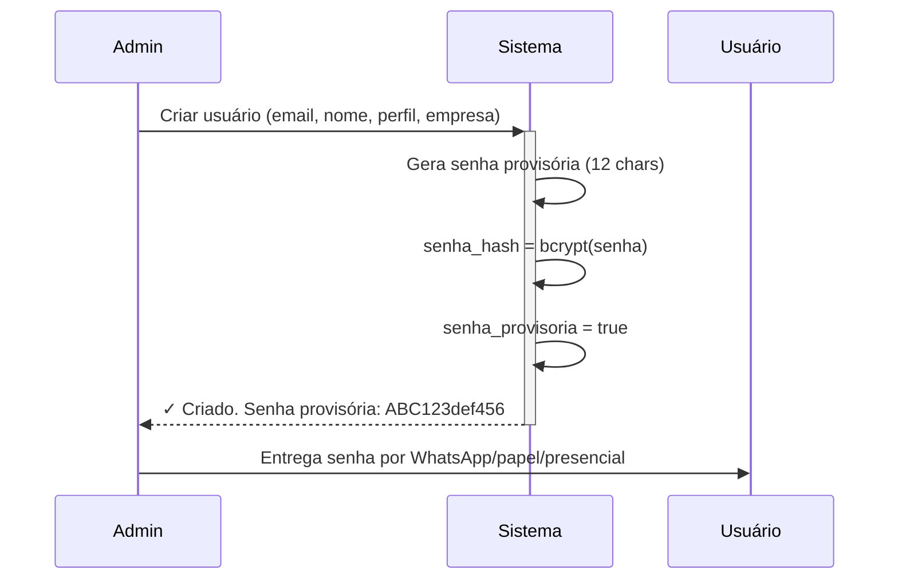
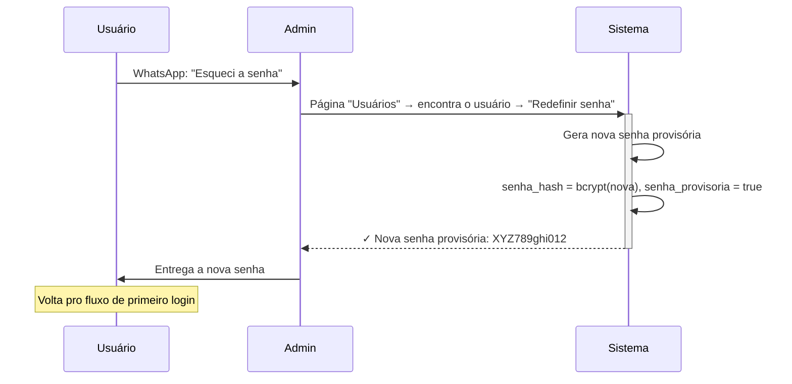

# Fluxo de Autenticação — SIGO Obras

**Decisão de produto (2026-05-26):** SIGO Obras **NÃO usa reset de senha por email**. Substituído por fluxo de **senha provisória + troca no primeiro acesso**.

## Por que não usar reset por email

| Aspecto                | Reset por email                             | Senha provisória + admin     |
| ---------------------- | ------------------------------------------- | ---------------------------- |
| Dependência de SMTP    | Sim (Resend, SES, etc.)                     | **Não**                      |
| Risco de phishing      | Médio (links públicos)                      | **Baixo**                    |
| Tokens expiráveis      | Sim, complexo                               | **Não tem**                  |
| Custo operacional      | Provider de email                           | **R$ 0**                     |
| Escalabilidade         | Alta                                        | Boa até ~100 usuários        |
| Tempo de implementação | Médio (template + Edge Function + provider) | **Baixo** (só campo boolean) |

Pra **13 empresas atuais**, a abordagem com senha provisória é mais simples, mais segura e zero custo.

## Fluxo padrão

### Cadastro de usuário (admin)



### Primeiro login

```mermaid
sequenceDiagram
    Usuário->>+Frontend: email + senha provisória
    Frontend->>+Edge Function login-custom: { email, senha }
    Edge Function->>+DB: SELECT * FROM usuario_custom WHERE email = ?
    DB-->>-Edge Function: { senha_hash, senha_provisoria: true, ... }
    Edge Function->>Edge Function: bcrypt.compare(senha, senha_hash) ✓
    Edge Function-->>-Frontend: JWT com claim must_change_password=true
    Frontend->>Frontend: detecta must_change_password
    Frontend->>+Usuário: Mostra tela "Defina sua nova senha"
    Usuário->>+Frontend: nova_senha + confirmar
    Frontend->>+Edge Function alterar-senha: { senha_atual, nova_senha }
    Edge Function->>DB: UPDATE senha_hash = bcrypt(nova), senha_provisoria = false
    Edge Function-->>-Frontend: novo JWT sem must_change_password
    Frontend-->>-Usuário: Redireciona pro dashboard
```

### Próximos logins

Fluxo normal: email + senha → JWT → dashboard. Sem prompt de troca de senha.

### "Esqueci minha senha"



## Modelagem no banco

### Coluna `senha_provisoria` (boolean default true)

Adicionada em:

- `usuario_custom` (admin, staff)
- `cliente_portal_usuario` (cliente externo do portal)
- `fornecedor_acesso` (login do portal do fornecedor)

```sql
senha_provisoria boolean not null default true;
```

Valor:

- `true` — usuário criado por admin, deve trocar no próximo login
- `false` — usuário já trocou a senha pelo menos 1 vez

### Colunas LEGADO (não usadas no fluxo atual)

Mantidas em `usuario_custom` apenas para compatibilidade com dados migrados:

- `reset_token` — sempre NULL em registros novos
- `reset_token_expira` — sempre NULL em registros novos

Podem ser removidas em uma migration futura quando confirmarmos que zero registros legacy usam.

## Edge Function `login-custom`

```typescript
// supabase/functions/login-custom/index.ts (rascunho)

import { createClient } from "@supabase/supabase-js";
import bcrypt from "bcrypt";

Deno.serve(async (req) => {
  const { email, senha } = await req.json();

  const supabase = createClient(/* service role */);
  const { data: usuario } = await supabase
    .from("usuario_custom")
    .select("*")
    .eq("email", email.toLowerCase())
    .eq("ativo", true)
    .maybeSingle();

  if (!usuario) return new Response("Email ou senha inválidos", { status: 401 });

  const ok = await bcrypt.compare(senha, usuario.senha_hash);
  if (!ok) return new Response("Email ou senha inválidos", { status: 401 });

  // Resolve empresa_id ativo (multi-empresa via UsuarioEmpresa)
  const { data: vinculos } = await supabase
    .from("usuario_empresa")
    .select("empresa_id, perfil, is_owner")
    .eq("usuario_email", email)
    .eq("ativo", true);

  // Gera JWT customizado via Supabase Auth admin API
  const { data: session } = await supabase.auth.admin.createUser({
    email,
    email_confirm: true,
    app_metadata: {
      empresa_id: vinculos[0]?.empresa_id,
      perfil: vinculos[0]?.perfil,
      is_super_admin: usuario.is_super_admin,
      must_change_password: usuario.senha_provisoria, // ← FLAG-CHAVE
    },
  });

  return Response.json({ session });
});
```

(Implementação completa numa fase posterior do roadmap.)

## Frontend

### Componente `MudarSenhaProvisoria.jsx`

```jsx
// Renderizado em apps/web/src/components/auth/MudarSenhaProvisoria.jsx

export function MudarSenhaProvisoria() {
  const { user, refreshSession } = useAuth();
  const [novaSenha, setNovaSenha] = useState("");
  const [confirmar, setConfirmar] = useState("");

  async function handleSubmit() {
    if (novaSenha !== confirmar) return toast.error("Senhas não conferem");
    if (novaSenha.length < 8) return toast.error("Mínimo 8 caracteres");

    await base44.functions.invoke("alterar-senha", { nova_senha: novaSenha });
    await refreshSession();
    toast.success("Senha alterada!");
    // useAuth detecta must_change_password=false → libera o dashboard
  }
  // ...
}
```

### Guarda de rota

```jsx
// apps/web/src/components/ProtectedRoute.jsx

export function ProtectedRoute({ children }) {
  const { user } = useAuth();
  if (!user) return <Navigate to="/login" />;
  if (user.must_change_password) return <MudarSenhaProvisoria />;
  return children;
}
```

### Tela `EsqueciSenha.jsx`

Vira tela informativa:

```jsx
<div>
  <h1>Esqueceu sua senha?</h1>
  <p>Por segurança, redefinições de senha são feitas exclusivamente pelo administrador da sua empresa.</p>
  <p>
    <strong>Entre em contato com o administrador</strong> e peça a redefinição. Você receberá uma nova senha provisória
    e poderá definir uma nova no próximo login.
  </p>
  <Link to="/login">Voltar para login</Link>
</div>
```

## Functions Base44 descartadas

Não precisam ser portadas para Edge Functions Supabase:

| Function legacy                     | Status        |
| ----------------------------------- | ------------- |
| `solicitarResetSenha`               | ❌ DESCARTADO |
| `redefinirSenha` (via token email)  | ❌ DESCARTADO |
| `validarTokenReset`                 | ❌ DESCARTADO |
| `enviarResetSenhaAdmin`             | ❌ DESCARTADO |
| `enviarTokenRecuperacaoEmail`       | ❌ DESCARTADO |
| `enviarTokenRecuperacaoEmailCustom` | ❌ DESCARTADO |

## Functions que ficam (e ganham mais sentido)

| Function                | Pra que serve                                                                   |
| ----------------------- | ------------------------------------------------------------------------------- |
| `loginCustom`           | Login normal — adicionar check `senha_provisoria → must_change_password` no JWT |
| `criarUsuarioComSenha`  | Admin cria com senha provisória gerada                                          |
| `alterarSenha`          | Usuário muda própria senha (no primeiro acesso ou depois)                       |
| `redefinirSenhaAdmin`   | Admin reseta senha de outro pra nova provisória                                 |
| `redefinirSenhaUsuario` | (alternativa de `redefinirSenhaAdmin`)                                          |

## Política de senha

Recomendações pro frontend validar antes de enviar pra Edge Function:

- **Mínimo:** 8 caracteres
- **Recomendado:** 12 caracteres
- **Composição:** maiúscula + minúscula + número (forçada por validação)
- **Bloquear:** sequências óbvias (12345678, qwerty), nome do usuário, email
- **Nunca exibir:** senhas no UI (sempre `type="password"`)

## Segurança operacional

- **Senhas provisórias são geradas pelo sistema** (não digitadas pelo admin) para evitar fraquezas como "123456" ou nome da empresa
- Gerador: 12 caracteres, alfanumérico, com pelo menos 1 número e 1 letra maiúscula
- Logs: registrar em `audit_log` toda criação de usuário e redefinição de senha (admin email + alvo + timestamp)
- Nunca logar a senha em texto puro (nem em audit, nem em console.log)

## Implementação no roadmap

| Fase                                     | O que                                                  |
| ---------------------------------------- | ------------------------------------------------------ |
| ✅ Schema                                | Migration 0016 (coluna `senha_provisoria`) — **feita** |
| ⏳ Edge Function `login-custom`          | Próxima                                                |
| ⏳ Edge Function `alterar-senha`         | Próxima                                                |
| ⏳ Edge Function `redefinir-senha-admin` | Próxima                                                |
| ⏳ Frontend `MudarSenhaProvisoria.jsx`   | Após Edge Functions                                    |
| ⏳ Frontend `ProtectedRoute` ajustado    | Após Edge Functions                                    |
| ⏳ Reescrita da `EsqueciSenha.jsx`       | Pequena, mas obrigatória pra UX                        |
