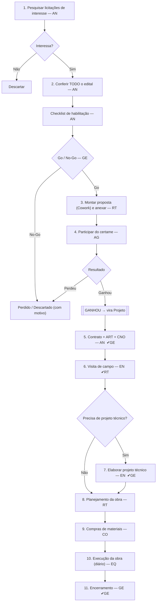

# Mapa de processos — Licitação → Obra (RASCUNHO para revisão)

> **Objetivo:** desenhar o fluxograma completo do processo, com a **função** e as
> **atividades** de cada responsável, ANTES de implantar no SIGO. Este documento
> **não altera nada no sistema** — é a "planta". Depois de validado, vira a spec
> de implantação (fluxo configurável por empresa; aprovação só nas fases críticas).
>
> ⚠️ Este é um **rascunho meu** com suposições. **Revise e corrija** (funções,
> atividades, quem aprova, fases que faltam ou sobram). O processo tem que
> refletir a SUA operação, não a minha suposição.

## Decisões já tomadas

- Proposta: feita no **skill do Cowork** e **anexada** (não se constrói no SIGO).
- Participação no certame: **manual** (sem automação).
- Aprovação formal (gate): **só nas fases críticas** (Contrato/ART/CNO, Projeto
  técnico, Encerramento).
- Template de fases: **configurável por empresa**.
- Papéis: _a decidir_ (você quer mapear o organograma/funções completo primeiro).

## Legenda de papéis (PROVISÓRIO — confirme/edite)

| Sigla | Papel                     | Responsável por                                           |
| ----- | ------------------------- | --------------------------------------------------------- |
| AN    | **Analista (licitações)** | pesquisar, conferir edital, habilitação, contrato/ART/CNO |
| GE    | **Gestor**                | decisão Go/No-Go, aprovações críticas, encerramento       |
| RT    | **Responsável Técnico**   | proposta, planejamento, aprova visita                     |
| EN    | **Engenharia**            | visita de campo, projeto técnico                          |
| AG    | **Agente de licitações**  | participar do certame (sessão/lances)                     |
| CO    | **Compras**               | cotação e compra de materiais                             |
| EQ    | **Equipe de obra**        | execução + diário                                         |

## Fluxograma (renderiza no GitHub/VS Code)

## Detalhamento por fase (função × atividades)

| #   | Fase                            | Resp. | Atividades                                                               | Entra                | Sai               | Aprova   | No SIGO (hoje → futuro)     |
| --- | ------------------------------- | ----- | ------------------------------------------------------------------------ | -------------------- | ----------------- | -------- | --------------------------- |
| 1   | Pesquisar licitações            | AN    | busca por palavra-chave/UF/cidade/órgão/valor; triagem                   | edital/aviso         | licitação "Nova"  | —        | ✅ aba Licitações           |
| 2   | Conferir edital                 | AN    | ler edital; preencher **checklist de habilitação**; resumir objeto/risco | licitação            | parecer           | —        | ⚠️ falta checklist (futuro) |
| —   | Go / No-Go                      | GE    | decidir participar                                                       | parecer              | decisão           | **GE**   | ⚠️ falta gate (futuro)      |
| 3   | Montar proposta                 | RT    | montar planilha de preços (Cowork) e anexar                              | orçamento            | proposta (PDF)    | —        | ✅ anexo na oportunidade    |
| 4   | Participar                      | AG    | sessão/lances no portal                                                  | proposta             | resultado         | —        | manual (registra resultado) |
| 5   | Contrato + ART + CNO            | AN    | assinar contrato; emitir **ART** (nº/CREA); abrir **CNO** (nº/data)      | resultado            | contrato+ART+CNO  | **GE**   | ❌ criar campos/anexos      |
| 6   | Visita de campo                 | EN    | vistoria; fotos; medições; restrições; parecer                           | contrato             | laudo de visita   | **RT**   | ❌ criar registro           |
| 7   | Projeto técnico (se for o caso) | EN    | memorial; plantas; ART de projeto                                        | laudo                | projeto técnico   | **GE**   | ❌ criar (anexos)           |
| 8   | Planejamento da obra            | RT    | montar cronograma de execução (etapas/datas)                             | projeto/laudo        | cronograma        | —        | ✅ cronograma_etapa         |
| 9   | Compras de materiais            | CO    | orçamento → solicitação → cotação → pedido                               | cronograma/orçamento | materiais         | (já tem) | ✅ Compras                  |
| 10  | Execução                        | EQ    | tocar a obra; diário de obra                                             | materiais            | obra em andamento | —        | ✅ diario_obra              |
| 11  | Encerramento                    | GE    | termo de recebimento; as-built                                           | obra concluída       | obra encerrada    | **GE**   | ❌ criar (anexos)           |

> ✔/Aprova = fase crítica com **gate de aprovação** (só estas, conforme decisão).

## O que eu preciso que você confirme/edite

1. **Organograma/funções:** a lista de papéis acima está certa? Tem cargo que
   falta (ex.: Diretor, Orçamentista, Encarregado, Almoxarife)? Quem realmente
   faz cada atividade na Sinergia?
2. **Fases:** falta alguma etapa? Ex.: _garantia/caução_, _impugnação do edital_,
   _assinatura digital_, _medição/faturamento da obra_, _retenções_, _SST/PCMSO
   da obra_, _entrega técnica_?
3. **Aprovadores:** quem aprova cada fase crítica (cargo fixo? a pessoa escolhe?).
4. **Captura:** os campos que cada fase guarda (coluna "Atividades/Sai") batem?
5. **Outros processos da empresa:** você falou em "todos os processos". Quer que
   eu estenda este mapa para os processos de **apoio** também (Financeiro,
   RH/SST, Estoque, Frota/Ferramental)? Se sim, me diga quais entram.

## Próximo passo (sem mexer no sistema)

Você revisa/edita este mapa (pode escrever direto aqui as correções). Quando
estiver fiel à operação, ele vira a **spec de implantação** no SIGO — fases
configuráveis por empresa + aprovação nas críticas, reaproveitando
`tarefa_projeto` + `aprovacao_solicitacao` (ver `REVISAO-FLUXO-LICITACAO-OBRA.md`).
